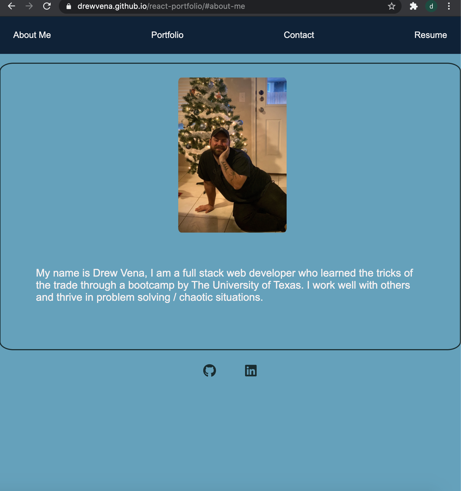

# react-portfolio
 
  (https://opensource.org/licenses/MIT)

Link to deployed App: https://drewvena.github.io/react-portfolio

 ##  Description
 ### This is my portfolio rebuilt using React! 
 ---
 ## Table of Contents
 - [Installation](#installation)
 -[License](#license)
 -[Tests](#tests)
 -[Questions](#questions)
 ---
 ## Installation
 ###### npm i
 
 ## License
 ###### This project is licensed under the terms of MIT
 ###### license.
 
 ## Tests
 ###### Run npm test to run tests.
 
 ## Questions
 ###### If you have any questions about this repo, contact https://github.com/drewvena/react-portfolio
 
 ## Email
 ###### drewvena1@gmail.com
